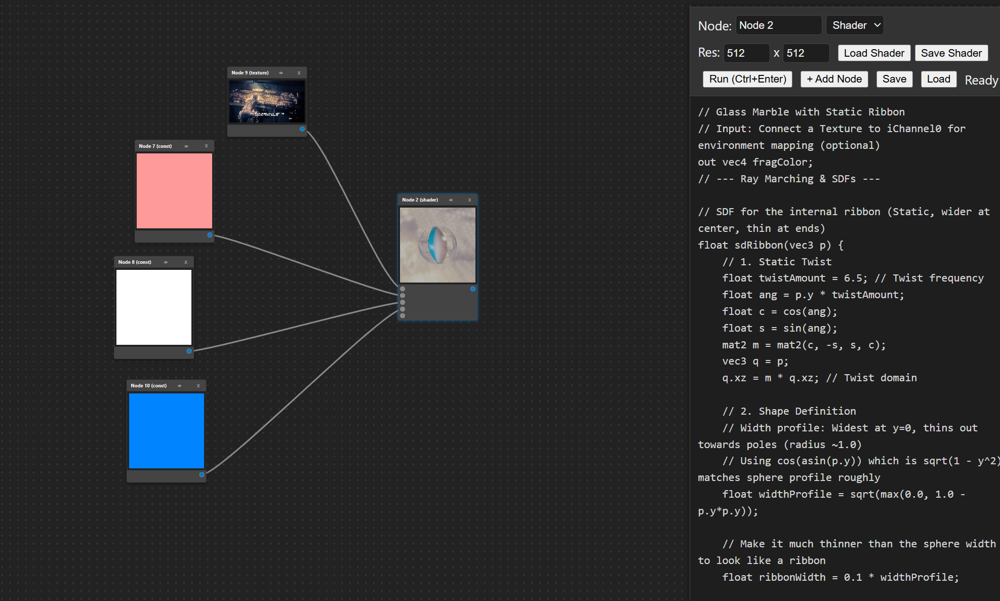

# ShaderToy Lab



[English](#english) | [中文](#chinese)

<a name="english"></a>
**ShaderToy Lab** is a powerful node-based shader editor for experimenting with GLSL and creating complex visual effects. Inspired by tools like Blender's Shader Editor and ShaderToy, it brings a modular workflow to WebGL development.

Instead of writing a single monolithic shader, you can break down your effects into reusable nodes, chain them together, and visualize intermediate results in real-time.

---

## 🌟 Key Features

- **Node-Based Workflow**:
  - **Shader Nodes**: Write custom GLSL code for each node.
  - **Texture Nodes**: Load images as input textures.
  - **Visual Graph**: Drag, drop, and connect nodes to build your pipeline.
  
- **Real-Time Preview**:
  - Live preview on every node.
  - Toggle visibility to optimize performance.
  - Infinite canvas with Pan & Zoom controls.

- **Advanced Persistence**:
  - **Full Graph Saving**: Save your entire workspace state (nodes, connections, positions) to `graph.json`.
  - **Shader Library**: Import and export individual shader files (`.frag`) to build your own library.
  - **Auto-Recovery**: Automatic local storage backup to prevent data loss.

- **Built-in Uniforms**:
  - Support for standard ShaderToy uniforms: `iTime`, `iResolution`, `iMouse`, etc.
  - Multi-pass rendering via node connections (`iChannel0`, `iChannel1`, etc.).

---

## 🚀 Getting Started

To access all features (specifically saving/loading files), you need to run the included local Python server.

### Prerequisites
- Python 3.x installed.

### Installation & Running
1. Clone the repository:
   ```bash
   git clone https://github.com/XZYW7/ShaderToyLab.git
   cd ShaderToyLab
   ```

2. Start the local server:
   ```bash
   python server.py
   ```

3. Open your browser and navigate to:
   ```
   http://localhost:8000
   ```

*(Note: You can open `index.html` directly, but Save/Load file features will be disabled due to browser security restrictions.)*

---

## 🎮 Controls

| Action | Shortcut / Control |
| :--- | :--- |
| **Pan Workspace** | `Middle Mouse Click` or `Alt + Left Click` + Drag |
| **Zoom Workspace** | `Mouse Wheel` |
| **Compile Shader** | `Ctrl + Enter` (when editor is focused) |
| **Save Graph** | Click `Save` button (Ctrl+S behavior coming soon) |
| **Connect Nodes** | Drag from `Output` to `Input` socket |
| **Disconnect** | Click on a stored connection (feature in progress) or overwrite |

---

## 🛠 Tech Stack

- **Frontend**: Vanilla JavaScript (ES6+), WebGL2.
- **Backend**: Python `http.server` (Zero dependency, standard library).
- **Styling**: CSS3 with a dark, modern IDE-like theme.

## 📝 License

This project is open source. Feel free to fork and contribute!

---
<a name="chinese"></a>

# ShaderToy Lab (中文介绍)

**ShaderToy Lab** 是一个强大的基于节点的 Shader 编辑器，用于实验 GLSL 可以在本地创建复杂的视觉效果。其灵感来自于 Blender 的 Shader 编辑器和 ShaderToy，旨在为 WebGL 开发带来模块化的工作流。

你不再需要编写一个巨大的单一 Shader 代码，而是可以将效果拆解为可复用的节点，将它们链接在一起，并实时查看中间结果。

---

## 🌟 核心功能

- **节点化工作流**:
  - **Shader 节点**: 为每个节点编写独立的 GLSL 代码。
  - **纹理节点**: 加载图片作为输入纹理。
  - **可视化图表**: 拖拽并连接节点来构建渲染管线。
  
- **实时预览**:
  - 每个节点都有实时预览画面。
  - 可以切换预览可见性以优化性能。
  - 支持无限画布的平移与缩放。

- **高级存储**:
  - **全图保存**: 将整个工作区状态（节点、连线、位置）保存到 `graph.json`。
  - **Shader 库**: 导入和导出单个 Shader 文件（`.frag`）以构建你自己的库。
  - **自动恢复**: 自动备份到 Local Storage，防止数据丢失。

- **内置 Uniforms**:
  - 支持标准的 ShaderToy Uniforms：`iTime`, `iResolution`, `iMouse` 等。
  - 通过节点连接实现多 Pass 渲染 (`iChannel0`, `iChannel1` 等)。

---

## 🚀 快速开始

为了使用所有功能（特别是文件的保存/加载），你需要运行项目自带的本地 Python 服务器。

### 环境要求
- 安装 Python 3.x。

### 安装与运行
1. 克隆仓库：
   ```bash
   git clone https://github.com/XZYW7/ShaderToyLab.git
   cd ShaderToyLab
   ```

2. 启动本地服务器：
   ```bash
   python server.py
   ```

3. 打开浏览器并访问：
   ```
   http://localhost:8000
   ```

*(注意：你可以直接双击打开 `index.html`，但由于浏览器的安全限制，保存/加载文件的功能将无法使用。)*

---

## 🎮 操作控制

| 动作 | 快捷键 / 控制方式 |
| :--- | :--- |
| **平移画布** | `鼠标中键` 或 `Alt + 左键` + 拖动 |
| **缩放画布** | `鼠标滚轮` |
| **编译 Shader** | `Ctrl + Enter` (当代码编辑器获得焦点时) |
| **保存图表** | 点击 `Save` 按钮 |
| **连接节点** | 从 `Output` 拖动到 `Input` 插槽 |
| **断开连接** | 点击已有的连线（开发中）或覆盖连接 |

---

## 🛠 技术栈

- **前端**: 原生 JavaScript (ES6+), WebGL2.
- **后端**: Python `http.server` (零依赖，基于标准库).
- **样式**: CSS3 (暗色系，现代 IDE 风格).

## 📝 许可证

本项目开源。欢迎 Fork 和贡献代码！

